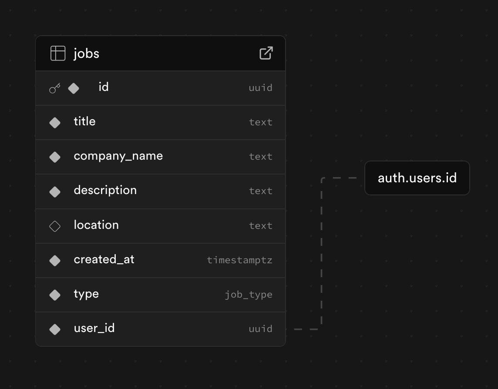

## Setup Instructions

First, run the development server:

```bash
npm run dev
# or
yarn dev
# or
pnpm dev
# or
bun dev
```

Open [http://localhost:3000](http://localhost:3000) with your browser to see the result.

You can start editing the page by modifying `app/page.tsx`. The page auto-updates as you edit the file.

This project uses [`next/font`](https://nextjs.org/docs/app/building-your-application/optimizing/fonts) to automatically optimize and load [Geist](https://vercel.com/font), a new font family for Vercel.

## Approach

0. Create jobs table, FK to users table
1. Supabase auth for email confirmation & user storage management
2. Create single JobForm for both create and update
3. Pagination for jobs to limit queries
4. TailwindCSS + ShadCn for beautiful UI

## Architecture



## What would you improve if given more time?

- Two different user types (job-poster, job-seeker)
- Can switch between these types through toggle
- Add animations
- Better form validation
- Better toast styling
- Google auth
- Add location API
